

<a href="https://www.linkedin.com/in/giorgikobaidze/"></a><a href="https://x.com/georgekobaidze"></a><a href="https://www.youtube.com/@Pilotronica"></a><a href="https://discord.com/users/571315867426488330"></a>
<a href="https://github.com/georgekobaidze/noterunway"></a><a href="https://github.com/georgekobaidze/metal-birds-watch"></a>
<a href="https://github.com/georgekobaidze/sunday-dev-drive"></a><a href="https://github.com/georgekobaidze/neuralhats"></a>

